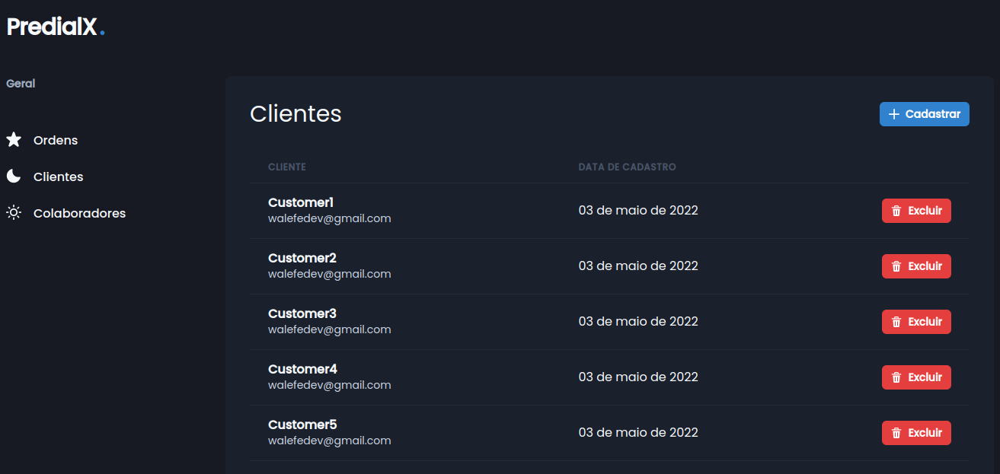

## Predialx
 This is a simple client for this [API](https://github.com/walefe/predialx-api)
 
 
## Getting started

1. Clone this repo using `https://github.com/walefe/predial-client`
2. Move to the appropriate directory: `cd predial-client`. 
3. Run `yarn` or `npm i` to install dependencies. 
4. Run `yarn dev` or `npm run dev` to see the example app at `http://localhost:3000`.
